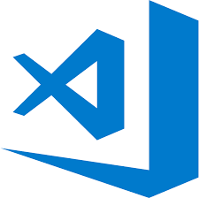

## Hi there, I'm Boris Grigorov 🎉 ##

### I'm creating apps, websites and other garbage... ###

 

### In my coding life, I use this tools and languages: ##

 
 

<!---->

### Checkout my website: [https://vvveb.cz/](https://vvveb.cz/) ###
 

### If you want to support me: ###
